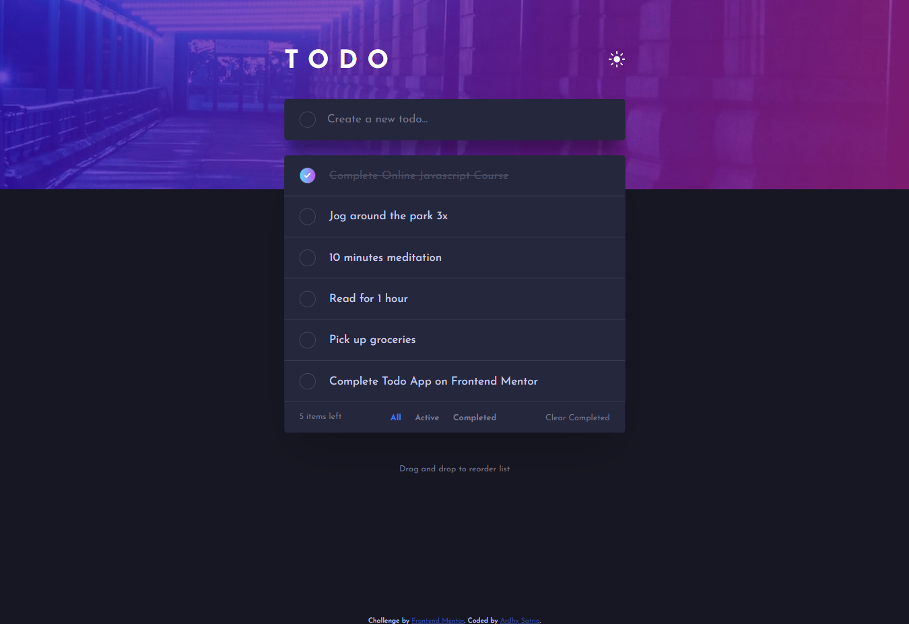

# Frontend Mentor - Todo app solution

This is a solution to the [Todo app challenge on Frontend Mentor](https://www.frontendmentor.io/challenges/todo-app-Su1_KokOW). Frontend Mentor challenges help you improve your coding skills by building realistic projects.

## Table of contents

- [Overview](#overview)
  - [The challenge](#the-challenge)
  - [Screenshot](#screenshot)
  - [Links](#links)
- [My process](#my-process)
  - [Built with](#built-with)
  <!-- - [What I learned](#what-i-learned)
  - [Continued development](#continued-development) -->
  - [Useful resources](#useful-resources)
- [Author](#author)
<!-- - [Acknowledgments](#acknowledgments) -->

## Overview

### The challenge

Users should be able to:

- View the optimal layout for the app depending on their device's screen size
- See hover states for all interactive elements on the page
- Add new todos to the list
- Mark todos as complete
- Delete todos from the list
- Filter by all/active/complete todos
- Clear all completed todos
- Toggle light and dark mode
- **Bonus**: Drag and drop to reorder items on the list

### Screenshot

### Links

- Solution URL: [My Solution](https://www.frontendmentor.io/solutions/todo-app-challenges-solution-W-1Wu-Wtv)
- Live Site URL: [https://ardhysatrio.me/todo-app](https://ardhysatrio.me/todo-app)

## My process

### Built with

- Semantic HTML5 markup
- CSS custom properties
- Flexbox
- Mobile-first workflow
- [Sortable.js](https://github.com/SortableJS/Sortable) - JS library for Drag N Drop

<!-- ### What I learned

 this section to recap over some of your major learnings while working through this project. Writing these out and providing code samples of areas you want to highlight is a great way to reinforce your own knowledge. -->

<!-- ### Continued development

Use this section to outline areas that you want to continue focusing on in future projects. These could be concepts you're still not completely comfortable with or techniques you found useful that you want to refine and perfect. -->

### Useful resources

- [Sortable js documentation](https://github.com/SortableJS/Sortable) - This helped me for implementing drag n drop feature, especially for touch devices.

## Author

- Website - [Ardhy Satrio](https://ardhysatrio.me)
- Frontend Mentor - [@kadabengarann](https://www.frontendmentor.io/profile/kadabengarann)
- Twitter - [@kadabengarannn](https://twitter.com/kadabengarannn)

<!-- ## Acknowledgments

This is where you can give a hat tip to anyone who helped you out on this project. Perhaps you worked in a team or got some inspiration from someone else's solution. This is the perfect place to give them some credit. -->
